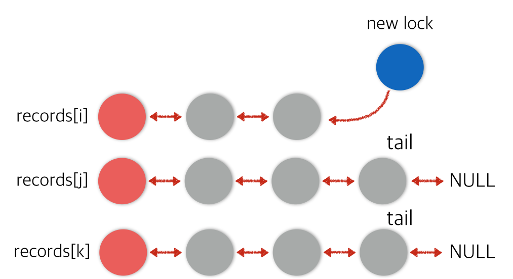

# Simple Two-phase locking with Readers-wrtier Lock

Concurrent Programming Project #2

---
---

## Table of Contents

#### 1. Design 
 1.1. Lock table 
 1.2. Lock protocols 
 1.3. Reader-writer lock 
 1.4. Deadlock 

#### 2. Algorithm
 2.1. Data structure 
 2.2. Lock functions 
 2.3. Other functions 
 2.4. Thread function 

#### 3. Github

#### 4. Result

 
 

---

## 1. Design

#### <h3>1.1. Lock Table

For each record, locks that attempt to access the record line up. This line acts like FIFO queue. The lock table can be represented by the **double linked-list** of this whole locks waiting for access to their records. This is illustrated in figure below.

> Lock table
> 

  

#### 1.2. Lock protocols

To implement the **two-phase locking system with Readers-write lock**, we have to make that each thread's transaction must runs in synchronization with each other. It needs to be scheduled especially to avoid data racing and deadlock.

There are two critical locking protocols needed. One of them is `pthread_lock`, which means global lock using `pthread_mutex`. It is mainly used when one of threads accesses some shared values. However, in this case, we can improve performance dividing an exclusive lock into **reader lock** and **write lock**. Unlike the other, the first one can access whenever there are only reader-locks holding a lock. Because it never updates the shared value, so it is possible that multiple reader-locks can access same shared value concurrently.
  

#### 1.3. Reader-Write lock

In this regard, this is the second critical locking protocol, **spin-lock**. It can be implemented using a while loop. By giving each the different while state conditions, they will be in loop until each order is reached.
  
**1.3.1. reader lock while state conditions**
* I'm the first at the record's queue
* The locks in front of me are all reader locks

**1.3.2. write lock while state condition**
* I'm the first at the record's queue
  

#### 1.4. DeadLock

The deadlock occurs when a lock in front of me is behind me in the queue of another record. So we can find the deadlock by checking queues of all locks in front of me. This work can be implemented using **DFS algorithm**.
 
 

---

## 2. Algorithm

#### 2.1. Data Structures

**2.1.1. Lock structure** 

> Using this lock structure, you can make a lock table. 
> The tail pointer is only used in the head node of record.
~~~c++
#define READ_LOCK 1
#define WRITE_LOCK 2
struct lock_h{
    // the owner of this lock
    size_t tid;
    // the type of lock
    // 0 for null, 1 for read_lock, 2 for write_lock
    int type;
    // pointers to next and pre
    struct lock_h* next;
    struct lock_h* pre;
    struct lock_h* tail;
};
~~~

**2.1.2. Each thread's transaction state**  

> ptrRecord[num] points to its lock on the record[num]
~~~c++
struct thread_stat{
    // Thread number
    size_t tid;
    // Pointers which point to each record
    struct lock_h* ptrRecord[3];
};
~~~

#### 2.2. Lock Functions

**2.2.1 readLockChecker** 
> Checks if all locks waiting in front of a given lock are read locks.
~~~c++
bool readLockChecker(struct lock_h* lock){
    lock_h* tmp = lock;
    while(tmp->pre != NULL){
        if(tmp->type == WRITE_LOCK){
            return false;
        }
        tmp = tmp->pre;
    }
    return true;
}
~~~

**2.2.2. removeLock** 
> Dequeue 
> It removes the given lock in the linked-list.
~~~c++
void removeLock(int recordNum, struct lock_h* lock){
    if(lock->next == NULL){
        lock->pre->next = NULL;
        lock_table[recordNum].tail = lock->pre;
        lock = NULL;
    }
    else{
        lock->pre->next = lock->next;
        lock->next->pre = lock->pre;
        lock = NULL;
    }
    return;
}
~~~

**2.2.3. DeadlockChecker** 
> Check for a deadlock using DFS algorithm.
~~~c++
bool isDeadLock(struct lock_h* lock, size_t src){
    // Base case
    if(lock->pre == NULL){
        return false;
    }
    else if(lock->tid == src){
        return true;
    }
    // DFS search using Recursion
    while(lock->pre != NULL){
        if(isDeadLock(lock->pre, src)){
            return true;
        }
        lock = lock->pre;
    }
    return false;
}
~~~

#### 2.3. Other Functions

**2.3.1 randGenerator**
>Generate random numbers by using the commit_id as seed.

~~~c++
void randGenerator(size_t* i, size_t* j, size_t* k, size_t commit_id){
    srand(commit_id);

    *i = rand() % R;

    do{
        *j = rand() % R;
    }while(*j==*i);

    do{
        *k = rand() % R;
    }while(*k == *i || *k == *j);

    return;
}
~~~

**2.3.2. printLog**
>print out the result on the .txt files

~~~c++
void printLog(size_t tid, size_t commit_id, size_t i, size_t j, size_t k){
    stringstream sstm;
    sstm << "thread" << tid+1 << ".txt";
    ofstream out(sstm.str().c_str(), ios::app);
    if(out.is_open()){
        out << commit_id << " " << i << " " << j << " " << k << " " << records[i] << " " << records[j] << " " << records[k] << endl;
    }
    out.close();
    return;
}
~~~

#### 2.4. Thread(Transaction) function
Because the main actions in the transaction are very similar to each other, here is just one case that updates records[k] value.

**2.4.1. threadFunc()** 

* create a lock object and set the pointers
~~~c++
// Create a lock object
input3.tid = tid;
input3.type = WRITE_LOCK;
input3.next = NULL;
threads_stat[tid].ptrRecord[2] = &input3;
~~~

* Before check some conditions, first add the lock on the linked-list, the lock table. 
* Because the lock-table is a shared variable, from now on it have to be locked using `global_mutex`.
~~~c++
// The moment that the lock is on the list of the record
// Enqueue
pthread_mutex_lock(&global_mtx);
lock_table[k].tail->next = &input3;
input3.pre = lock_table[k].tail;
lock_table[k].tail = &input3;
~~~

* First, check whether the added lock is the head of the record's linked-list.
* If it is, just update the value.
* If not, check for deadlock.
* If deadlock is, release whole locks. In other words, remove whole locks from each linked-list.
* If not, it waits using spin-lock until it catches the lock.
~~~c++
// Try to catch the lock of the record
if(threads_stat[tid].ptrRecord[2]->pre == &lock_table[k]){
   // Write
   k_value = records[k];
   records[k] -= i_value;
   pthread_mutex_unlock(&global_mtx);
 }
 else{
    if(isDeadLock(threads_stat[tid].ptrRecord[2], tid)){
    // Dequeue
   		removeLock(i, threads_stat[tid].ptrRecord[0]);
    	removeLock(j, threads_stat[tid].ptrRecord[1]);
    	removeLock(k, threads_stat[tid].ptrRecord[2]);
    	pthread_mutex_unlock(&global_mtx);
    	continue;
    }
    else{
        pthread_mutex_unlock(&global_mtx);
        // Spin-lock
        while(threads_stat[tid].ptrRecord[2]->pre != &lock_table[k]){
        }
        k_value = records[k];
        records[k] -= i_value;
    }
}

* Commit session
* Release all reader-write locks.
* If the commit_id exceed `E`, roll back using memorized old values.
* If not, restart the while statement.

~~~c++
// Acquire global mutex
        pthread_mutex_lock(&global_mtx);
        // Release all R/W lock
        // Dequeue
        removeLock(i, threads_stat[tid].ptrRecord[0]);
        removeLock(j, threads_stat[tid].ptrRecord[1]);
        removeLock(k, threads_stat[tid].ptrRecord[2]);
        // Get commit_id from the global execution order value
        commit_id = ++global_exec;
        if(commit_id > E){
            // Roll-back, then exit
            records[i] = i_value;
            records[j] = j_value;
            records[k] = k_value;
            pthread_mutex_unlock(&global_mtx);
            exit(1);
        }
        // Record the results
        printLog(tid, commit_id, i, j, k);
        pthread_mutex_unlock(&global_mtx);
~~~

  

---

## 3. Github

You can get the whole source code in my [Github](https://github.com/heeveloper/ParallelProgramming/tree/master/project2)
 

---

## 4. Result

The result is successful as long as the record value does not exceed a 64-bit integer. 
If the value exceed the 64-bit maximum or minimum value, overflow can occur. In such cases, correctness can not be guaranteed.
 
 

---
---
