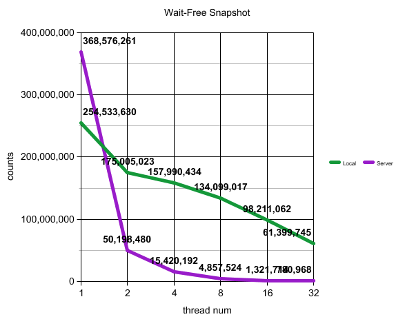

# Wait-free Atomic snapshot

Concurrent Programming Project #3

---
---

## Table of Contents

#### 1. Atomic Snapshot
#### 2. Wait-Free Snapshot
#### 3. Algorithm
#### 4. Result

 

---

## 1. Atomic Snapshot

An **atomic snapshot** constructs an instantaneous view of an array of atomic registers. An **atomic snapshot object** acts like a collection of n single-writer multi-reader(**SWMR**) atomic registers  with a special snapshot operation that returns (what appears to be) the state of all n registers at the same time. I construct a **wait-free snapshot**, meaning that a thread can take an instantaneous snapshot of memory without delaying any other thread. Atomic snapshots might be useful for backups or checkpoints.
  

---

## 2. Wait-Free Snapshot

 A wait-free implementation is equivalent(that is, linearizable) to the sequential specification. The key property of this sequential implementation is that `scan()` returns a collection of values, each corresponding to the latest preceding `update()`, that is returns a collection of register values that existed together in the same system state.
  

 ---

## 3. Algorithm

#### 3.1. Data structure

~~~c 
 typedef struct stamp_snap{
    long stamp;
    long value;
    long * snap;
} stamp_snap;
~~~

#### 3.2. Global Variables

 ~~~c 
 int thread_num;
 stamp_snap * a_table;
 stamp_snap ** _copy;
 bool ** moved;
 long ** result;
 ~~~
 

#### 3.3. Main functions  

**3.3.1 wait_free_initialize** 
Initialize global variables before threads run.
  

**3.3.2. collect** 
In `scan()`, it is used for fetch an stamp_snap array of corresponding thread number.

~~~c 
stamp_snap * collect(long tid){
    for(int i=0; i<thread_num; i++)
        _copy[tid][i] = a_table[i];

    return _copy[tid];
}
~~~
  

**3.3.3. scan** 
To make the `scan()` method wait-free, each `update()` call helps a `scan()`if may interfere with, by taking a snapshot before modifying its register(thread). A `scan()` that repeatedly fails in taking a double collect can use the snapshot from one of the interfering `update()` calls as its own. The tricky part is that we must make sure the snapshot taken from the helping update is one that can be linearized within the `scan()` call’s execution interval.  
The wait-free construction is based on the following observation: if a scanning thread A sees a thread B move twice while it is performing repeated collects, then B executed a complete `update()` call within the interval of A’s `scan()`, so it is correct for A to use B’s snapshot.

~~~c 
long * scan(long tid){
    int flag = 1;
    stamp_snap * old_copy;
    stamp_snap * new_copy;
    old_copy = collect(tid);
    while(1){
        new_copy = collect(tid);
        for(int i=0; i< thread_num; i++){
            if(old_copy[i].stamp != new_copy[i].stamp){
                if(moved[tid][i]){
                    for(int j=0;j<thread_num; j++)
                        moved[tid][j] = 0;
                    return old_copy[i].snap;
                }
                else{
                    moved[tid][i] = true;
                    old_copy = new_copy;
                    flag = 0;
                    break;
                }
            }
            if(i==thread_num)
                flag = 1;
        }
        if(flag){
            for(int i=0;i<thread_num; i++)
                result[tid][i] = new_copy[i].value;
            return result[tid];
        }
    }
}
~~~
  

**3.3.4 update** 
We say that a thread **moves** if it completes an `update()`. Each update() call calls `scan()`, and appends the result of the scan to the value’s label. 

~~~c 
void update(long value, long tid){
    long * snap = scan(tid);
    stamp_snap old_value = a_table[tid];
    stamp_snap new_value[1];
    new_value[0].stamp = old_value.stamp + 1;
    new_value[0].value = value;
    new_value[0].snap = snap;
    a_table[tid] = new_value[0];
}
~~~
  

**3.3.5. ThreadFunc** 
For a minute, it calls `update()` within value and tid, then increments count value.

~~~c 
void* ThreadFunc(void * arg){
    long tid = (long)arg;
    clock_t start_t = clock();
    clock_t tmp;
    long count = 0;
    long value = tid;
    while(true){
        // while loop for 60 seconds
        tmp = clock() - start_t;
        if((tmp / CLOCKS_PER_SEC) > 59)
            return (void*)count;

        // Update 
        update(value++, tid);
        count++;
    }
    return NULL;
}
~~~
  
**You can see the whole source code in my [github](https://github.com/heeveloper/ParallelProgramming/tree/master/project3)**
  

---

## 4. Result
 

**4.1. Execution Environment** 

|        	| Local              	| Server                         	|
|--------	|--------------------	|--------------------------------	|
| OS     	| Ubuntu 16.04.3 LTS 	| Ubuntu 16.04.3 LTS             	|
| CPU    	| 2                  	| 24 x 2(hyperthreading enabled) 	|
| Memory 	| 2GB                	| 258GB                          	|

 

**4.2.  Graph**  

>

  

---
