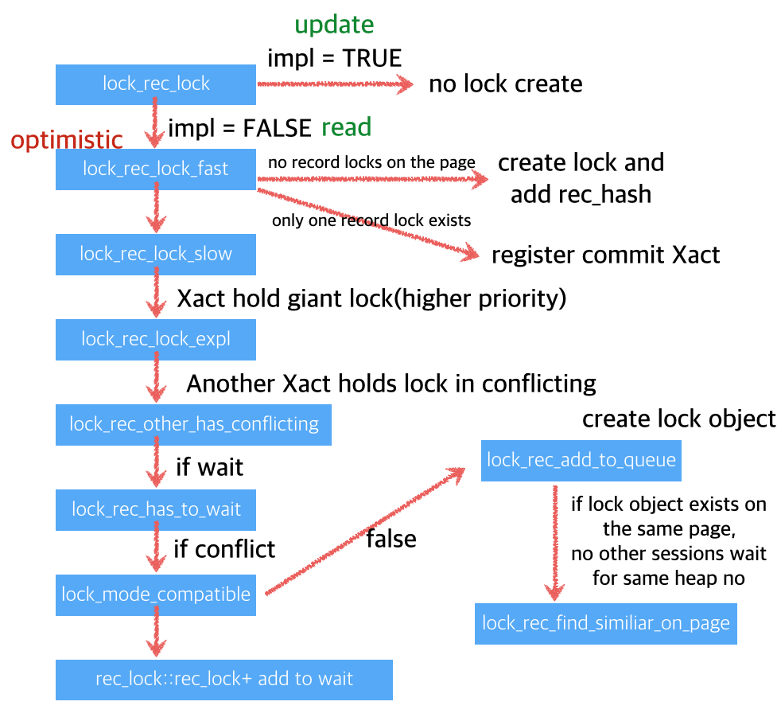
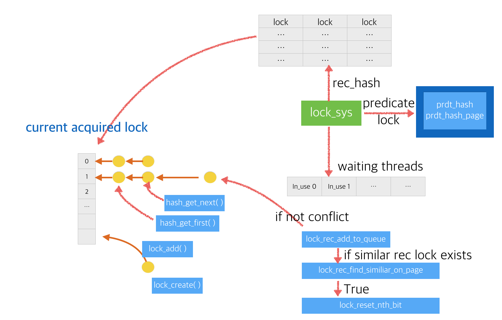
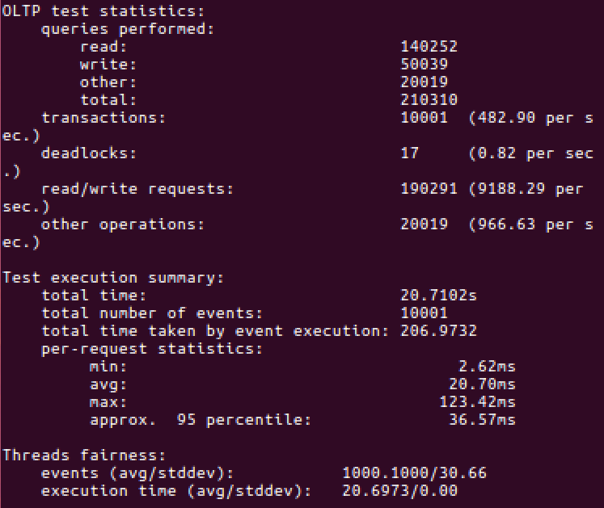
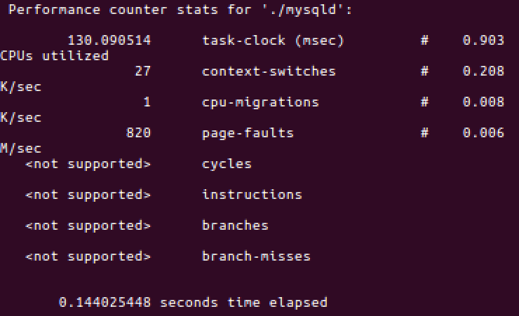
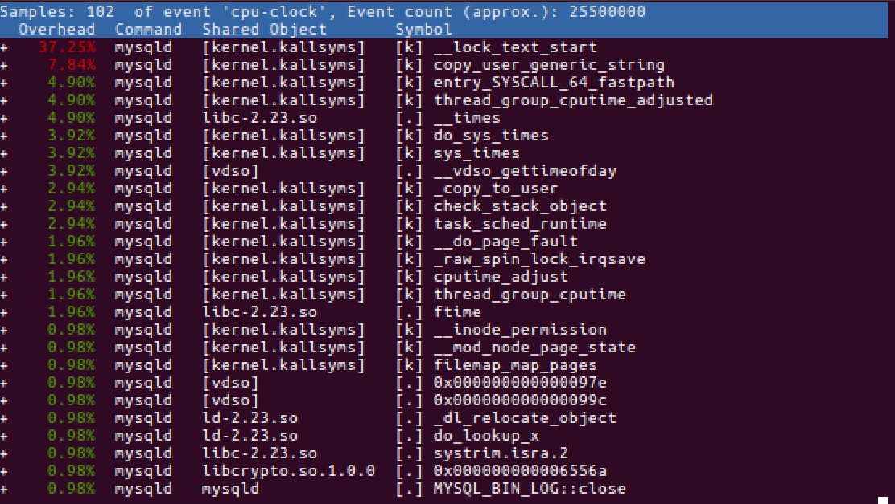

# MariaDB Scalable Lock Manager

Concurrent Programming Project #4

---
---

 

## Table of Contents

#### 1. Object
#### 2. Design
2.1. Analysis of existing one 
2.2. Bottleneck point 
2.3. Naive Design for read-only Xact 
2.4. Lightweight Lock management 
#### 3. Implentation
#### 4. Results
4.1. OLTP benchmark 
4.2. Sampling events on a running server 
4.3. Analyze the output file generated from perf record 

  

---

 

## 1. Object

 

There are several performance bottlenecks in the lock manager of InnoDB storage engine, which is used by default in MariaDb 10.2.. InnoDB's lock manager is the first bottleneck, and the final goal of the project is to make this part scalable to improve the performance of mariaDB. 

Milestone1 needs to solve the performance bottleneck that occurs when performing only read-only transactions. Read-only transactions only request a shared lock on the record for which the value is to be read. If all transactions are read-only There is no problem reading the values of any record at the same time, but InnoDB's lock manager protects the process of acquiring locks through the global mutex, which is a performance bottleneck.
   

---

 

## 2. Design

 

#### 2.1. Analysis of existing one

The below figure shows the overall management of the locking in the existing InnoDB's lock manager.

> MariaDB Lock management system 1
> 

 

> MariaDB Lock management system 2
> 

  

#### 2.2. Bottleneck point

As you can see int the picture above, regardless of the type of operation, such as write or read, the lock manager goes through the lock table once it locks, and at this point it gets the entire global mutex. 
In the case of a transaction with only read operations, this is actually unnecessary because it only requires shared locks. Because of this, in the case of read-only transactions, you should design a more simple and lightweight lock manager without following the existing lock management.
  

#### 2.3. Naive Design for read-only Xact

In the case of read-only transaction, a more lightweight lock system is built without using lock management using existing lock tables. The naive design is removing the lock. However, this is not practical because it is a rule that can only be used in special cases.
  

#### 2.4. Lightweight Lock management

Just like the read lock (shared lock) implemented in project2, it simply checks that there is no write lock in front of the record you want to access. If there is a read lock, this is not a problem.
  

---

 

## 3. Implentation

I just can improve performance by removing the whole locking in the special case of read-only transaction. 
In the `lock_rec_lock_fast` function, by adding the case that the mode is S_lock in the condition that there is no preceding lock, it is possible to acquire the lock for the corresponding record without performing a separate lock check or get global mutex in the case of read-only transaction. 

~~~ c
if (lock == NULL || mode == LOCK_S) {
	if (!impl) {
		RecLock rec_lock(index, block, heap_no, mode);
		// Note that we don't own the trx mutex.
		rec_lock.create(trx, false, true);
	}
	status = LOCK_REC_SUCCESS_CREATED;
}

~~~

  

---

 

## 4. Results

 

#### 4.1. OLTP benchmark

> 
 

#### 4.2. Sampling events on a running server

> 
 

#### 4.3. Analyze the output file generated from perf record

> 

   

---

